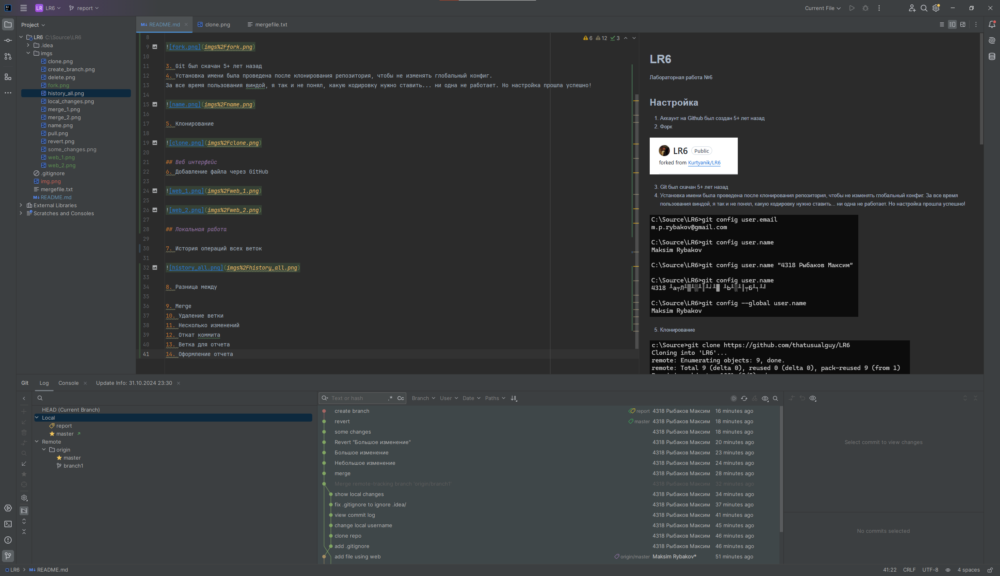

# LR6
Лабораторная работа №6

## Настройка

1. Аккаунт на Github был создан 5+ лет назад
2. Форк


3. Git был скачан 5+ лет назад
4. Установка имени была проведена после клонирования репозитория, чтобы не изменять глобальный конфиг.
За все время пользования виндой, я так и не понял, какую кодировку нужно ставить... ни одна не работает. Но настройка прошла успешно!


5. Клонирование


## Веб интерфейс
6. Добавление файла через GitHub


## Локальная работа

7. История операций всех веток


8. Все локальные изменения на момент скриншота


9. Merge через JetBrains IDEA. Второй скрин можно было и обрезать... 


10. Удаление ветки


11. Несколько изменений


12. Откат последнего коммита


13. Ветка для отчета


## Финальные штрихи

14. Оформление отчета (в процессе)



15. Красивая история операций


16. git push. Вначале текущую ветку (report), потом все ветки.


## Лог комманд
Собран после выполнения ЛР. Может отсутствовать несколько команд :(

```bash
git clone https://github.com/thatusualguy/LR6
cd LR6
git log --all
git diff b4a235d7b4d26b38e500f9b40d698dfe5ecc6a7b
git branch -d branch1
git add -A
git commit -m "Небольшие изменения"
git add -A
git diff HEAD
git commit -m "Большие изменения"
git diff HEAD~1
git branch report
git checkout report
git log --pretty=format:"%h + %cd + %an + %s"
git push --all
git push origin -d branch1
doskey /history > commands.log # выгрузка истории команд из CMD
```